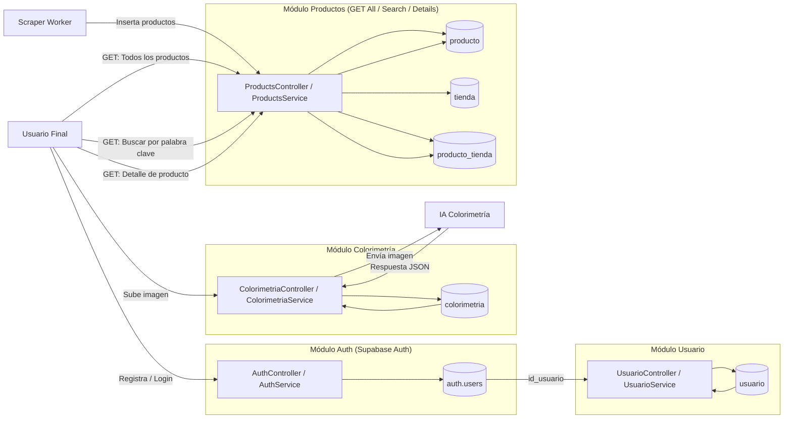

```mermaid
flowchart LR
    %% ==== ENTIDADES EXTERNAS ====
    User[Usuario Final]
    AI[IA Colorimetría]
    Scraper[Scraper Worker]

    %% ==== MÓDULO AUTH ====
    subgraph AUTH["Módulo Auth (Supabase Auth)"]
        AuthAPI[AuthController / AuthService]
        AuthDB[(auth.users)]
    end

    %% ==== MÓDULO USUARIO ====
    subgraph USERMOD["Módulo Usuario"]
        UsuarioAPI[UsuarioController / UsuarioService]
        UsuarioDB[(usuario)]
    end

    %% ==== MÓDULO COLOMETRÍA ====
    subgraph COLORIM["Módulo Colorimetría"]
        ColorAPI[ColorimetriaController / ColorimetriaService]
        ColorDB[(colorimetria)]
    end

    %% ==== MÓDULO PRODUCTOS (solo lectura) ====
    subgraph PRODUCTOS["Módulo Productos (GET All / Search / Details)"]
        ProdAPI[ProductsController / ProductsService]
        ProductoDB[(producto)]
        TiendaDB[(tienda)]
        ProdTiendaDB[(producto_tienda)]
    end

    %% ==== FLUJOS AUTH ====
    User -->|Registra / Login| AuthAPI
    AuthAPI --> AuthDB
    AuthDB -->|id_usuario| UsuarioAPI

    %% ==== RELACIÓN AUTH → USUARIO ====
    UsuarioAPI --> UsuarioDB
    UsuarioDB --> UsuarioAPI

    %% ==== COLOMETRÍA ====
    User -->|Sube imagen| ColorAPI
    ColorAPI -->|Envía imagen| AI
    AI -->|Respuesta JSON| ColorAPI

    ColorAPI --> ColorDB
    ColorDB --> ColorAPI

    %% ==== PRODUCTOS ====
    %% --- Inserción desde Worker ---
    Scraper -->|Inserta productos| ProdAPI
    ProdAPI --> ProductoDB
    ProdAPI --> TiendaDB
    ProdAPI --> ProdTiendaDB

    %% --- Consultas del usuario ---
    User -->|GET: Todos los productos| ProdAPI
    User -->|GET: Buscar por palabra clave| ProdAPI
    User -->|GET: Detalle de producto| ProdAPI

    ProdAPI --> ProductoDB
    ProdAPI --> ProdTiendaDB
```
